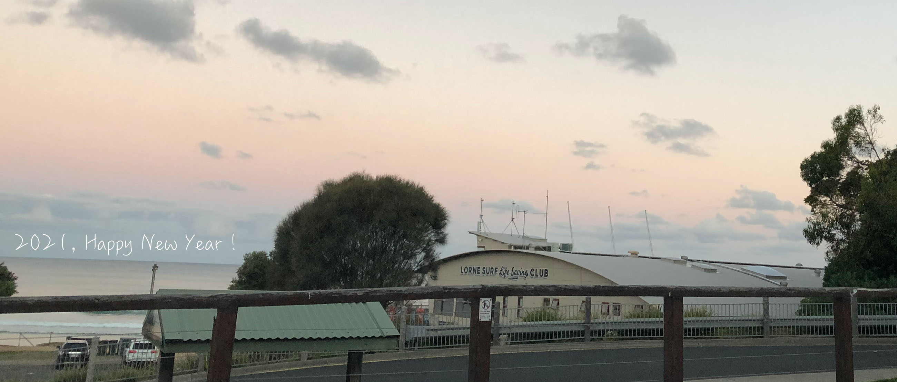

I am a PhD student at Monash University, supervised by Professor Bohan Zhuang and Professor Jianfei Cai. Prior to that, I completed my Master's degree in Computer Science at the University of Adelaide and got my Bachelor's degree in Software Engineering at Harbin Institute of Technology, Weihai. 

Previously, I worked on Vision-and-Language Navigation problems, these days I am more interested in Computer Vision and its related model efficiency problems. 

## Publication

Yuankai Qi, **Zizheng Pan**, Shengping Zhang, Anton van den Hengel, Qi Wu. Object-and-Action Aware Model for Visual Language Navigation. In Proceedings of European Conference on Computer Vision (**ECCV 2020**), 2020.

## Awards

- Adelaide Summer Research Scholarship, 2019
- Outstanding Graduate in Harbin Institute of Technology, 2019

