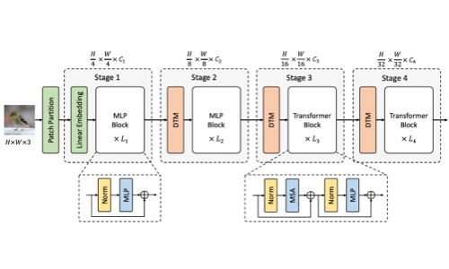
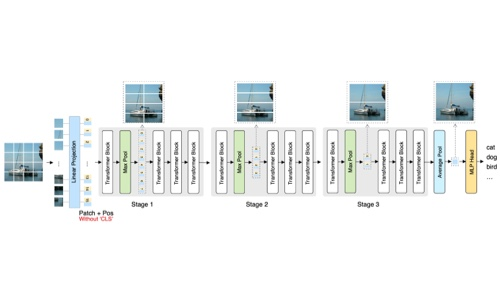
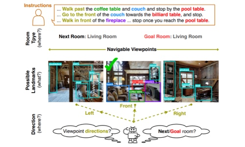
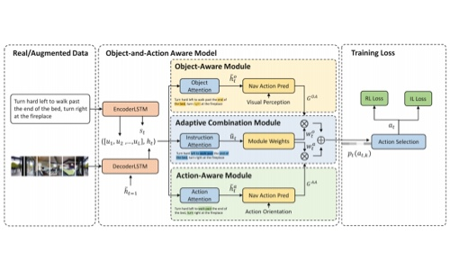

Hi 👋, I am a first-year PhD student at Monash University, supervised by [Dr. Bohan Zhuang](https://bohanzhuang.github.io/) and [Prof. Jianfei Cai](https://research.monash.edu/en/persons/jianfei-cai). I am a member of [Monash Green AI Lab](https://monashai.github.io/). My research focuses on model compression and efficiency.

## Education

- Ph.D in Computer Sience, Monash University, 2021 - Now.
- M.S. in Computer Science, The University of Adelaide, 2020.
- B.E. in Software Engineering, Harbin Institute of Technology, Weihai, 2019.

## Publication

<dl>
  <dt ></dt>
  <dt> Less is More: Pay Less Attention in Vision Transformers</dt>
  <dd><strong>Zizheng Pan</strong>, Bohan Zhuang, Haoyu He, Jing Liu, Jianfei Cai</dd>	
  <dd>
    <a href="https://github.com/MonashAI/LIT">[Code]</a>, 
    <a href="https://arxiv.org/abs/2105.14217">[Paper]</a>
  </dd>
</dl>

------

<dl>
  <dt ></dt>
  <dt> Scalable visual transformers with hierarchical pooling</dt>
  <dd><strong>Zizheng Pan</strong>, Bohan Zhuang, Jing Liu, Haoyu He, Jianfei Cai</dd>	
  <dd>
    <a href="https://arxiv.org/abs/2103.10619">[Paper]</a>
  </dd>
</dl>

---

<dl>
  <dt ></dt>
  <dt> Know What and Know Where: An Object-and-Room Informed Sequential BERT for Indoor Vision-Language Navigation</dt>
  <dd>Yuankai Qi, <strong>Zizheng Pan</strong>, Yicong Hong, Ming-Hsuan Yang, Anton van den Hengel, Qi Wu</dd>	
  <dd><a href="https://arxiv.org/abs/2104.04167">[Paper]</a></dd>
</dl>

---

<dl>
  <dt ></dt>
  <dt> Object-and-Action Aware Model for Visual Language Navigation</dt>
  <dd>Yuankai Qi, <strong>Zizheng Pan</strong>, Shengping Zhang, Anton van den Hengel, Qi Wu</dd>	
  <dd>European Conference on Computer Vision (<strong>ECCV</strong>), 2020</dd>
  <dd>
    <a href="https://arxiv.org/abs/2007.14626">[Paper]</a>
  </dd>
</dl>

## Awards

- Adelaide Summer Research Scholarship, 2019
- Outstanding Graduate in Harbin Institute of Technology, 2019

