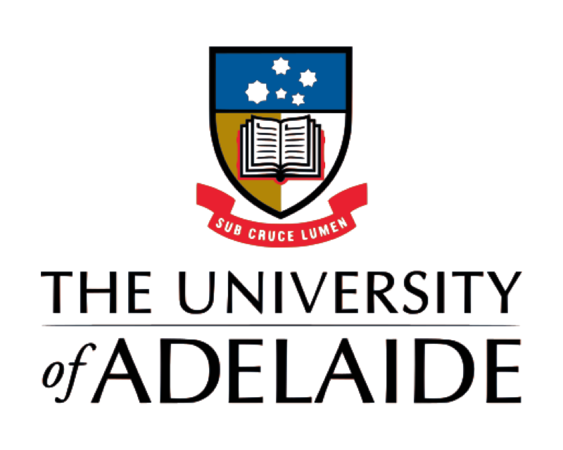

I recently graduated from the University of Adelaide and got my Master's degree in Computer Science. Prior to that, I got my Bachelor degree in Software Engineering at Harbin Institute of Technology, Weihai.

## Education Experience

<dl>
  <dt>
  
  </dt>
  <dt> The University of Adelaide, Adelaide, Australia</dt>
  <dd>July 2018 - June 2020</dd>
  <dd>M.S. in Computer Science</dd><dt>
  
  </dt>
  <dt> Harbin Institute of Technology, Weihai, China</dt>
  <dd>September 2015 - June 2019</dd>
  <dd>B.E. in Software Engineering</dd>
</dl>

## Publication

Yuankai Qi, **Zizheng Pan**, Shengping Zhang, Anton van den Hengel, Qi Wu. Object-and-Action Aware Model for Visual Language Navigation. In Proceedings of European Conference on Computer Vision (**ECCV 2020**), 2020.

## Awards

- Adelaide Summer Research Scholarship, 2019
- Outstanding Graduate in Harbin Institute of Technology, 2019

