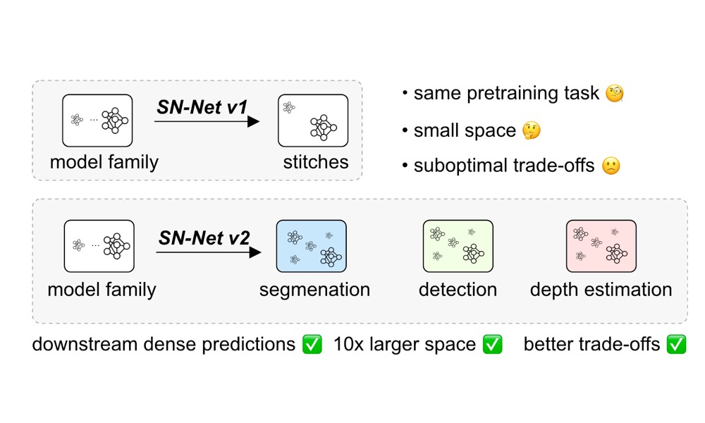
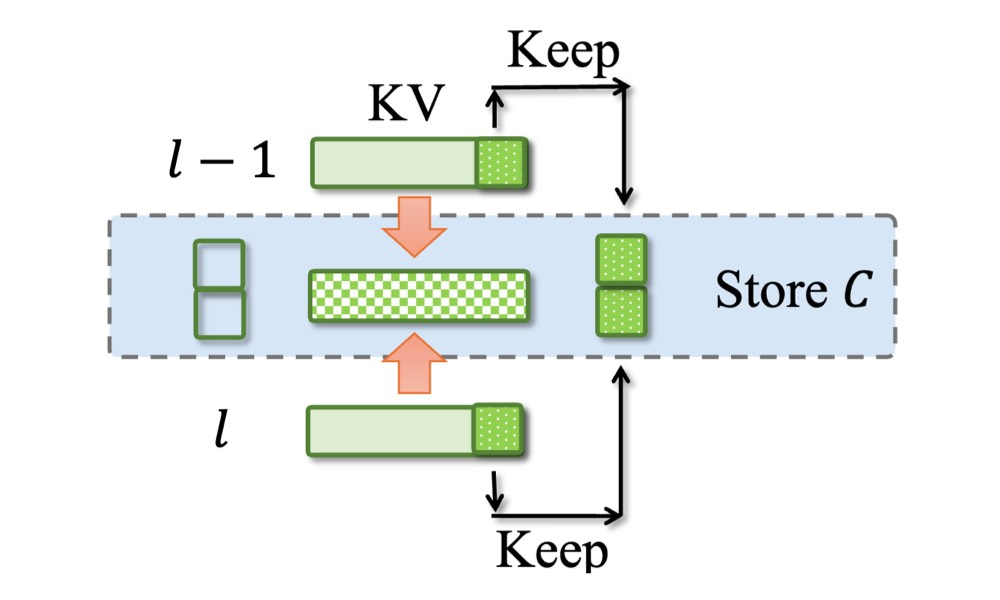
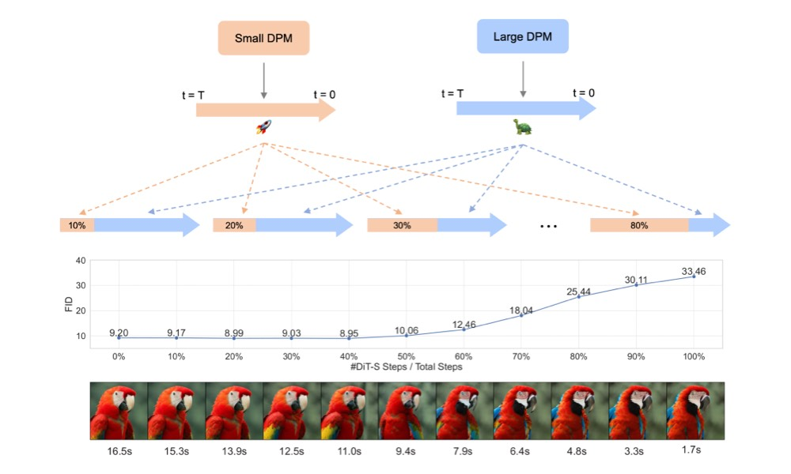
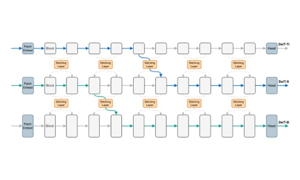
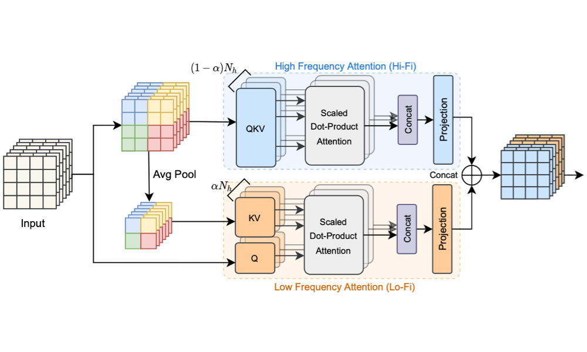
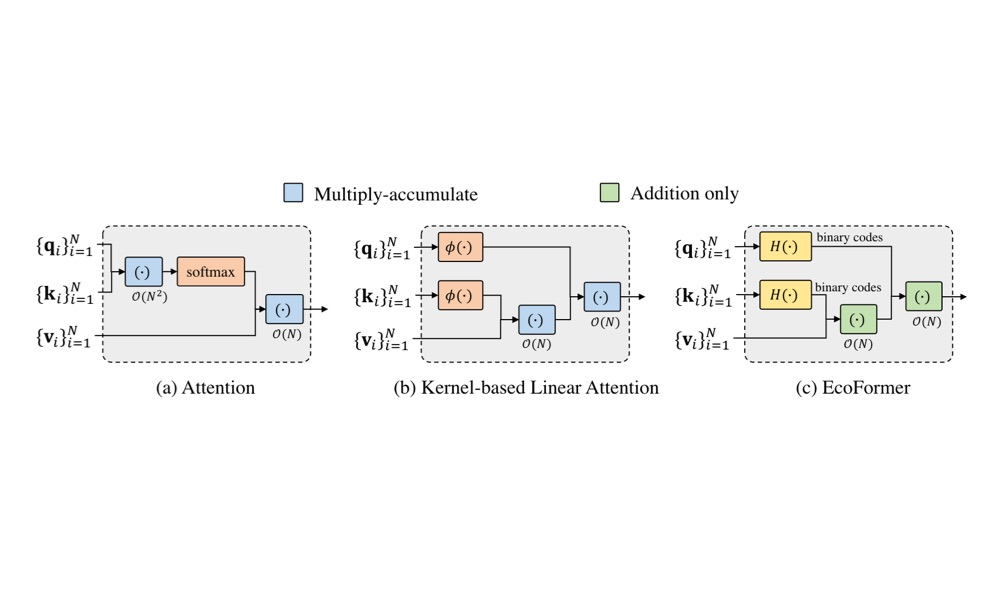
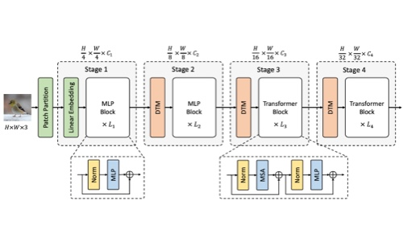
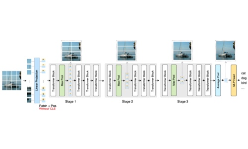

# About Me

Hi 👋, I am a researcher at [DeepSeek](https://x.com/deepseek_ai). I pursued my PhD at [ZIP Lab](https://ziplab.github.io/), Monash University, under the supervision of [Prof. Bohan Zhuang](https://scholar.google.com.au/citations?user=DFuDBBwAAAAJ) and [Prof. Jianfei Cai](https://scholar.google.com.au/citations?user=N6czCoUAAAAJ). Previously, I was a master's student at the University of Adelaide. Prior to that, I received my bachelor's degree from Harbin Institute of Technology, Weihai. My time on its beautiful coastal campus 🏖️ left me with many cherished memories.

<!-- My research during my PhD focused on efficiency in deep neural networks, including training, inference, and deployment. Some topics that I previously focused on:
- Flexible model deployment: [SN-Net](https://arxiv.org/abs/2302.06586), [SN-Netv2](https://arxiv.org/abs/2307.00154)
- Transformer architecture optimization: [LIT](https://arxiv.org/abs/2105.14217), [LITv2](https://arxiv.org/abs/2205.13213)
- Efficient attention mechanisms: [HiLo](https://arxiv.org/abs/2205.13213), [EcoFormer](https://arxiv.org/abs/2209.09004)
- Token pruning/merging for inference speedup: [HVT](https://arxiv.org/abs/2103.10619)
- Memory-efficient training: [Mesa](https://github.com/ziplab/Mesa) -->

Since 2024, I have been working on multimodal LLMs at DeepSeek. If you are interested in the following topics and in internship or full-time opportunities at DeepSeek, please feel free to contact me via email. We are always looking for talented candidates!

- VLM pretraining and post-training ([JD](https://app.mokahr.com/social-recruitment/high-flyer/140576#/job/7dcd6fde-84f1-4deb-890c-f1f275df0efc)).
- Multimodal agents.
- See [here](https://talent.deepseek.com/) for more open positions.

<!-- ## News
- **2024.09.26** &emsp; One paper is accepted by NeurIPS 2024!
- **2024.07.01** &emsp; First day at DeepSeek & One paper is accepted by ECCV 2024!
- **2023.12.29** &emsp; One paper is accepted by CVPR 2024!
- **2023.12.29** &emsp; One paper is accepted by TPAMI!
- **2023.10.25** &emsp; I gave an online talk at University of Massachusetts Amherst.
- **2023.04.20** &emsp; One paper is accepted by IJCAI 2023!
- **2023.04.11** &emsp; I will be interning at NVIDIA Research this summer.
- **2023.03.22** &emsp; SN-Net was selected as a highlight at CVPR 2023!🔥
- **2023.02.28** &emsp; Two papers are accepted by CVPR 2023!
- **2022.11.11** &emsp; Both LITv2 and Ecoformer will be presented as Spotlight!
- **2022.09.15** &emsp; Our [LITv2](https://arxiv.org/abs/2205.13213) and [EcoFormer](https://github.com/ziplab/EcoFormer) are accepted by NeurIPS 2022.
- **2022.07.04** &emsp; Our paper [STPT](https://arxiv.org/abs/2207.10448) is accepted by ECCV 2022.
- **2021.12.01** &emsp; Our paper [LIT](https://arxiv.org/abs/2105.14217) is accepted by AAAI 2022.
- **2021.07.23** &emsp; Our paper [HVT](https://arxiv.org/abs/2103.10619) and [ORIST](https://arxiv.org/abs/2104.04167) are accepted by ICCV 2021.

 -->

## Education

- Ph.D in Computer Science, Monash University, 2021 - 2024.
- M.S. in Computer Science, The University of Adelaide, 2018 - 2020.
- B.E. in Software Engineering, Harbin Institute of Technology, Weihai, 2015 - 2019.

## Work Experience

- Full-time researcher at DeepSeek, July, 2024 - Now.
- Research intern at NVIDIA, AI Algorithm Group, July, 2023 - Oct, 2023

## Selected Publications

[Full list](https://scholar.google.com.au/citations?user=w_VMopoAAAAJ)

<dl>
  <dt ></dt>
  <dt> Stitched ViTs are Flexible Vision Backbones</dt>
  <dd><strong>Zizheng Pan</strong>, Jing Liu, Haoyu He, Jianfei Cai, Bohan Zhuang</dd>
  <dd>European Conference on Computer Vision (<strong>ECCV</strong>), 2024</dd>
  <dd> 
    <a href="https://arxiv.org/abs/2307.00154">[Paper]</a>
    <a href="https://github.com/ziplab/SN-Netv2">[Code]</a> 
    <a href="https://snnet.github.io/snnetv2/">[Project Page]</a> 
  </dd>
</dl>

---

<!-- <dl>
  <dt ></dt>
  <dt>MiniCache: KV Cache Compression in Depth Dimension for Large Language Models</dt>
  <dd>Akide Liu, Jing Liu, <strong>Zizheng Pan</strong>, Yefei He, Gholamreza Haffari, Bohan Zhuang</dd>
  <dd> Conference on Neural Information Processing Systems (<strong>NeurIPS</strong>), 2024</dd>
  <dd>
    <a href="https://arxiv.org/abs/2405.14366">[Paper]</a>
  </dd>
</dl>

--- -->

<dl>
  <dt ></dt>
  <dt> T-Stitch: Accelerating Sampling in Pre-trained Diffusion Models with Trajectory Stitching</dt>
  <dd><strong>Zizheng Pan</strong>, Bohan Zhuang, De-An Huang, Weili Nie, Zhiding Yu, Chaowei Xiao, Jianfei Cai, Anima Anandkumar</dd>
  <dd> ArXiv, 2024. 
    <a href="https://arxiv.org/abs/2402.14167">[Paper]</a>
    <a href="https://github.com/NVlabs/T-Stitch">[Code]</a> 
    <a href="https://t-stitch.github.io/">[Project Page]</a> 
  </dd>
</dl>

---

<dl>
  <dt ></dt>
  <dt> Stitchable Neural Networks</dt>
  <dd><strong>Zizheng Pan</strong>, Jianfei Cai, Bohan Zhuang</dd>
  <dd> Conference on Computer Vision and Pattern Recognition (<strong>CVPR</strong>), 2023 (Highlight)</dd>
  <dd>
    <a href="https://github.com/ziplab/SN-Net">[Code]</a>, 
    <a href="https://arxiv.org/abs/2302.06586">[Paper]</a>,
    <a href="https://snnet.github.io/">[Project Page]</a>
  </dd>
</dl>

---

<dl>
  <dt ></dt>
  <dt> Fast Vision Transformers with HiLo Attention</dt>
  <dd><strong>Zizheng Pan</strong>, Jianfei Cai, Bohan Zhuang</dd>
  <dd> Conference on Neural Information Processing Systems (<strong>NeurIPS</strong>), 2022 (Spotlight)</dd>
  <dd>
    <a href="https://github.com/ziplab/LITv2">[Code]</a>, 
    <a href="https://arxiv.org/abs/2205.13213">[Paper]</a>,
    <a href="https://openreview.net/forum?id=Pyd6Rh9r1OT">[OpenReview]</a>
  </dd>
</dl>

---

<dl>
  <dt ></dt>
  <dt> EcoFormer: Energy-Saving Attention with Linear Complexity</dt>
  <dd>Jing Liu*, <strong>Zizheng Pan*</strong>, Haoyu He, Jianfei Cai, Bohan Zhuang (*equal contribution)</dd>
  <dd> Conference on Neural Information Processing Systems (<strong>NeurIPS</strong>), 2022  (Spotlight)</dd>
  <dd>
    <a href="https://github.com/ziplab/EcoFormer">[Code]</a>, 
    <a href="https://arxiv.org/abs/2209.09004">[Paper]</a>,
    <a href="https://openreview.net/forum?id=MK_130d4Y0">[OpenReview]</a>
  </dd>
</dl>

---

<dl>
  <dt ></dt>
  <dt> Less is More: Pay Less Attention in Vision Transformers</dt>
  <dd><strong>Zizheng Pan</strong>, Bohan Zhuang, Haoyu He, Jing Liu, Jianfei Cai</dd>
  <dd>AAAI Conference on Artificial Intelligence (<strong>AAAI</strong>), 2022</dd>
  <dd>
    <a href="https://github.com/ziplab/LIT">[Code]</a>, 
    <a href="https://arxiv.org/abs/2105.14217">[Paper]</a>
  </dd>
</dl>

---

<dl>
  <dt ></dt>
  <dt> Scalable Visual Transformers with Hierarchical Pooling</dt>
  <dd><strong>Zizheng Pan</strong>, Bohan Zhuang, Jing Liu, Haoyu He, Jianfei Cai</dd>
  <dd>International Conference on Computer Vision (<strong>ICCV</strong>), 2021</dd>
  <dd>
  	<a href="https://github.com/ziplab/HVT">[Code]</a>,
    <a href="https://arxiv.org/abs/2103.10619">[Paper]</a>
  </dd>
</dl>

## Teaching

- FIT5201 - Machine learning, 2022, TA

## Talk

- 2023.10.25  &emsp;  "Optimizing Vision Transformers for Efficient Training, Inference and Deployment", invited online talk at University of Massachusetts Amherst.

## Professional Activities

Reviewer: CVPR, ICCV, ECCV, NeurIPS, ICML, ICLR, IJCV

## Awards

- Google Travel and Conference Grants, 2023
- Monash Graduate Scholarship, 2020
- Adelaide Summer Research Scholarship, 2019
- Outstanding Graduate in Harbin Institute of Technology, 2019
